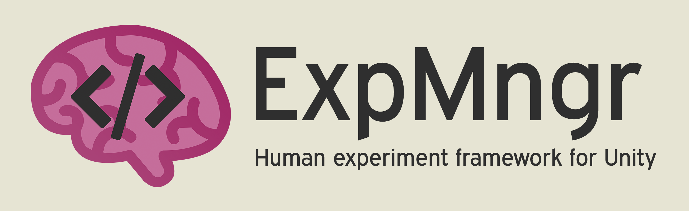
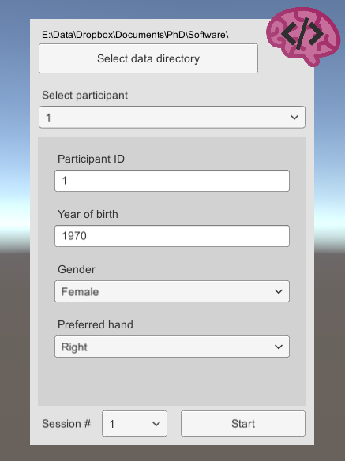

# UXF - Unity Experiment Framework
A set of C# scripts which simplifies management of human-based experiments developed in Unity. This is the development project, if you want to download the package, see [Releases](https://github.com/jackbrookes/unity-experiment-framework/releases). 

## Get started

Import the latest ```.unitypackage``` [release](https://github.com/jackbrookes/unity-experiment-framework/releases) to your existing Unity project.

Note: Users must change API Compatibility Level to .NET 2.0 in Unity player settings. 


## Features

### Programming style

* Classes for common experimental concepts such as `Session`, `Block` & `Trial`
* Helps create maintainable and readable code using an Object-Oriented Programming style, fitting in with Unity's Component System

### Data collection

ExpMngr automates the process of collecting behavioural and movement data. **Behavioural data** is collected with 1 row per `Trial`, and automatically records some values such as the timestamp of the start and end of the trial.
**Movement data** is the position and rotation of any object in the scene, which is captured at whatever frame rate the application is running at (in the `Update()` loop) by adding a `Tracker` component to a GameObject. This can be used to track positions of user controlled objects (such as hands or head in a virtual reality application) or an arbitrary object in the scene (e.g. some kind of stimuli). 
Data is stored in CSV files with automatic handling of file & directory naming.

### Events

A `UnityEvent` is invoked on `Trial` begin and end, allowing you to easily trigger presentation of stimuli at trial start (for example).

### CSV Participant List

A participant list feature is used allowing experimenters to optionally pre-prepare participant information. Additionally, this participant list is shared between experiments, allowing cross comparison of observations within participants.  

### Settings system

The settings is cascading, allowing setting independent variables at a `Session`, `Block`, or `Trial` level. Settings profiles can be stored as `.json` files and selected via the UI. This allows experimenters to deploy a single build of the experiment with several sub-experiments defined in settings profiles. The data for these sub-experiments is stored independently.   

### UI

A UI is available to load participant data from file (or add new participant data). Variables that are collected are customisable and can be used in the experiment (e.g. a parameter for a participant's age could be used to change the difficulty of the experiment).



### File IO

Files are read and written in a separate thread to avoid frame drops, which can induce motion sickness in VR HMDs.

## Example

UXF classes will be useful in two main parts of your project: 

#### 1. Building up your experiment structure, including the trials, blocks and their associated settings.

```csharp
class ExperimentBuilder : Monobehaviour
{
    // set this to your Session instance in the inspector
    public UXF.Session session;
    
    // assign this method to the Session OnSessionBegin UnityEvent in its inspector
    public void GenerateAndRun(UXF.Session session) 
    {       
        // Creating a block of 10 trials
        var myBlock = session.CreateBlock(10);

        // Add a new setting to trial 1, here just as an example we will apply a setting of "color" "red" 
        var firstTrial = myBlock.GetTrial(1); //trial number is not 0 indexed
        firstTrial.settings["color"] = "red";

        // Save session instance reference
        this.session = session;

        // Run first trial
        session.nextTrial.Begin();
    }

    ...

}
```


#### 2. Accessing trial settings when they are needed: 

```csharp
class SceneManipulator : MonoBehaviour
{
    public UXF.Session session;

    ...

    // assign this method to the Session OnTrialBegin UnityEvent in its inspector
    public void ShowStimulus(UXF.Trial trial)
    {
        // pull out the color we applied for this trial
        string colorManipulation = (string) trial.settings["color"];

        // example of using the new setting to manipulate our scene
        ManipulateSceneColor(colorManipulation);
    }

    // this could trigger on some user behaviour, collecting their score in a task
    public void RecordResultsAndEnd(int score)
    {
        // store their score
        session.currentTrial.results["score"] = score;
        // end this trial
        session.currentTrial.End();
    }

}
```


See `Assets/ExpMngr/ExampleScript.cs` for another simple example.


## Development

This project is developed under Unity 2017.3.0f3.

## Documentation

(In development)

## FAQ

(In development)