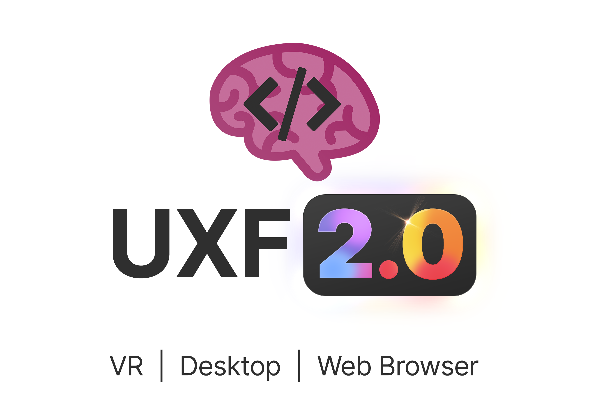
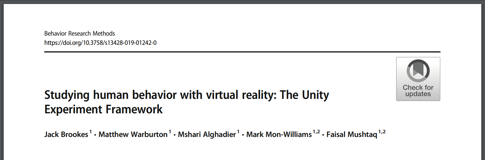
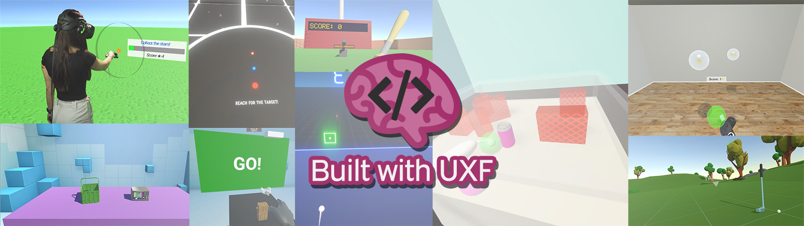
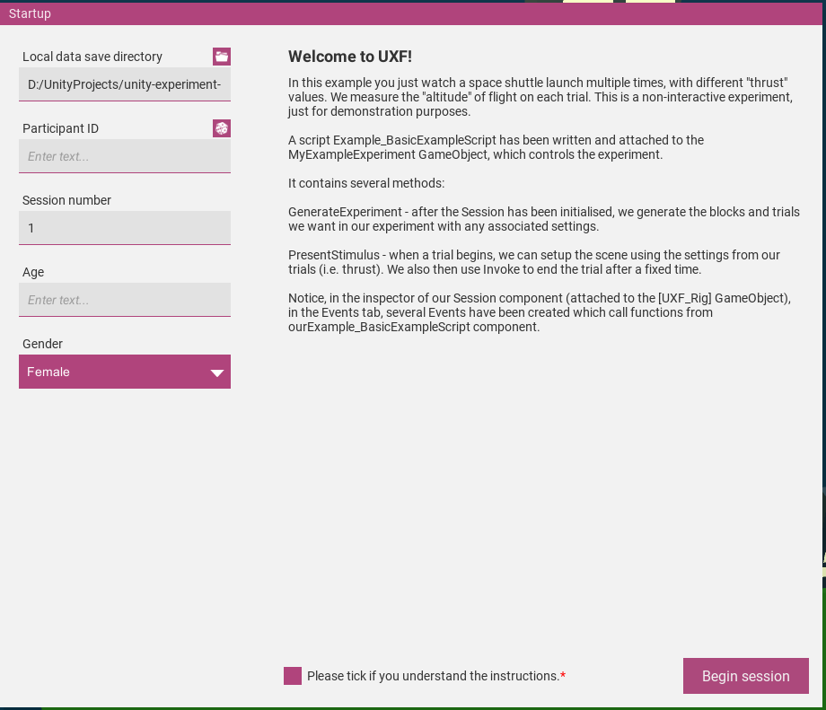

<p align="center">
  
</p>

# UXF - Unity Experiment Framework
A set of components which simplify human behaviour experiments developed in the Unity engine. UXF 2.0 supports experiments for VR, Desktop, as well as Web based experiments for full remote data collection, with different data output modes. This is the development project, if you want to download the package, do not clone this repository, see "Get Started" below. 

<p align="center">
  <a href="https://doi.org/10.3758/s13428-019-01242-0">
  
  </a>
  
  Read the [open access paper](https://doi.org/10.3758/s13428-019-01242-0) in Behavior Research Methods! The paper is now slightly out of date but gives a good overview of the motivation of this project. Developed by Jack Brookes, Immersive Cognition Group, University of Leeds.
</p>

If you have developed a project using UXF please [let me know](http://twitter.com/jackbrookes)! 

**Contents**
- [Built with UXF](#built-with-uxf)
- [Get started](#get-started)
- [Features](#features)
  - [Programming style](#programming-style)
  - [Data collection](#data-collection)
  - [Web & Database](#web-database)
  - [Events](#events)
  - [Settings system](#settings-system)
  - [UI](#ui)
- [Example](#example)
- [Development](#development)
- [Documentation](#documentation)
- [In the News](#in-the-news)
- [Tutorial: Building an experiment with UXF](#tutorial-building-an-experiment-with-uxf)

## Built with UXF

<p align="center">
  <a href="https://immersivecognition.github.io/projects/virtual-reality-experiments/" target="_blank">
  
  </a>
  
  Click the banner above to see some of our experiments that have been built with UXF.
</p>

## Get started

0. Read over this Readme and the [paper](https://doi.org/10.3758/s13428-019-01242-0) to understand UXF.

1. Import the latest ```UXF.unitypackage``` [release](https://github.com/immersivecognition/unity-experiment-framework/releases/latest) to your existing Unity project. (Drag the file into your project.)

2. The UXF Setup Wizard will launch (or via the top menu: UXF > UXF Wizard) - Use it to fix any compatibility issues. 

3. Open an example scene. (e.g. UXF -> Examples -> 2_MoveToTarget -> MoveToTargetExample)

4. Press play, and use the UI to enter any details.

5. Press start to begin the session.

Visit the [Wiki](https://github.com/immersivecognition/unity-experiment-framework/wiki) for more details.

## Features

### Programming style

* Classes for common experimental concepts such as `Session`, `Block` & `Trial`
* Helps create maintainable and readable code fitting with Unity's Component System

### Data collection

UXF automates the process of collecting data. How the data are stored depends on the platform (PC, Web, etc) as well as your configuration of different "Data Handlers". For PC platforms, you probably just want to store data in files on the PC locally. In that case, the File Saver data handler will output data in several forms: 

**Behavioural data** are collected with 1 row per `Trial`, and automatically records some values such as the timestamp of the start and end of the trial. Developers can easily record observations of any type and associate them with a trial. Data is output with one row per trial in a results csv file.

**Continuous data** are data that are measured continuously over time during a trial. The main use case of this is to track the position and rotation of any object in the scene, which is captured at whatever frame rate the application is running at (in the `Update()` loop) by adding a `PositionRotationTracker` component to a GameObject. This can be used to track positions of user controlled objects (such as hands or head in a virtual reality application) or an arbitrary object in the scene (e.g. some kind of stimuli). However this system is generic and developers can create their own `Tracker` classes that perform measurements of any variable during trials. 

Data is stored in CSV files with automatic handling of file & directory naming.

UXF also stores other data in the form of `.csv` & `.json` files (full details on the [Wiki](https://github.com/immersivecognition/unity-experiment-framework/wiki)). Running a session with UXF will result in several forms of data being stored:

| File(s) | Folder | Description |
|---|---|---|
| `trial_results.csv` | (none) | The main behavioural results file, with one row per trial. It also contains references (relative paths) to other trial-level data files such as tracker files, so you can read in the data and associate it with a trial. |
| `participant_details.csv` | /session_info | A copy of the participant's details (typically the data that are collected along with participant ID using the UI). Stored as a single row. |
| `log.csv` | /session_info | A copy of all `Debug.Log` calls during the session, as well as any other custom data saved under datatype SessionLog. |
| `settings.json` | /session_info | A copy of all settings applied as the session begins. |
| Trackers e.g `head_movement_T001.csv` | /trackers | A copy of tracker data, stored with one file per trial. Tracker data is continuous data, the most common will be tracking the movement of an object (e.g. head/hands) with the `PositionRotationTracker` component. |
| Other data | /other | Any other [custom data stored manually](https://github.com/immersivecognition/unity-experiment-framework/wiki/Collect-Custom-Data), associated with a trial or a session. |


**Example Output** You can see an example of the data structure UXF outputs in the [example_output](example_output/basic_example_1) folder of this repository.

### Web & Database

For Web platforms, the data cannot be stored on the participant's PC. Instead, data can be uploaded to a database. UXF handles all of the hard work for you and automatically uploads the data files as long as you set up a DynamoDB database using Amazon Web Services. 

### Events

A `UnityEvent` is invoked on `Trial` begin and end, allowing you to easily trigger presentation of stimuli at trial start (for example).

### Settings system

The settings is cascading, allowing setting independent variables at a `Session`, `Block`, or `Trial` level. Settings profiles can be stored as `.json` files and selected via the UI. This allows experimenters to deploy a single build of the experiment with several sub-experiments defined in settings profiles. The data for these sub-experiments is stored independently.   

### UI

A customisable user interface is optionally available to collect demographic data and present instructions to the user or experimenter. Variables that are collected are customisable and can be used in the experiment (e.g. a parameter for a participant's age could be used to change the difficulty of the experiment).

<p align="center">
  
</p>

## Example

UXF is built around the idea of separating the specification of your experiment (the "what") and the implementation of your experiment (the "how").

1. Experiment specification: Building/describing your experiment structure, including the trials, blocks and their associated settings.
2. Experiment implementation: Presenting stimuli according to independent variables, collecting dependent variables.

#### 1. Experiment specification

```csharp
public class ExperimentBuilder : MonoBehaviour
{
    // set this to reference your UXF Session in the inspector
    public UXF.Session session;
    
    // assign this method to the Session OnSessionBegin UnityEvent in its inspector
    public void GenerateAndRun() 
    {       
        // Creating a block of 10 trials
        var myBlock = session.CreateBlock(10);

        // Add a new setting to trial 1, here just as an example we will apply a setting of "color" to "red" 
        myBlock.FirstTrial.settings.SetValue("color", "red");

        ...

        // Start the session!
        session.FirstTrial.Begin();
    }

    ...

}
```


#### 2. Experiment implementation

```csharp
public class SceneManipulator : MonoBehaviour
{

    // set this to reference your UXF Session in the inspector
    public UXF.Session session;

    ...

    // assign this method to the Session OnTrialBegin UnityEvent in its inspector
    public void ShowStimulus(UXF.Trial trial)
    {
        // pull out the color we applied for this trial
        // output would be "red" on trial 1
        string colorManipulation = trial.settings.GetString("color");

        // example of using the new setting to manipulate our scene using a custom method
        ManipulateSceneColor(colorManipulation);
    }

    // this could trigger on some user behaviour (e.g. button response), collecting their score in a task
    public void RecordResultsAndEnd(int score)
    {
        // store their score
        session.CurrentTrial.result["score"] = score;
        // end this trial
        session.CurrentTrial.End();
    }

}
```

More examples are contained in the package and on the [Wiki](https://github.com/immersivecognition/unity-experiment-framework/wiki) including a full written tutorial.

## Development

This project is developed under Unity 2018.4 LTS but should work on all recent versions of Unity. Tested and working on Unity 2018 & 2019 LTS.

## Documentation

Visit the [Wiki](https://github.com/immersivecognition/unity-experiment-framework/wiki) for full documentation.

## In the News

* Ubiquitous Media Technology Lab Uses UXF for HCI research (Saarland University)
    - [Blink-Suppressed Hand Redirection](https://umtl.cs.uni-saarland.de/research/projects/blink-suppressed-hand-redirection.html) 
    - [Combining Dynamic Passive Haptics & Haptic Retargeting in VR](https://umtl.cs.uni-saarland.de/research/projects/shifty-and-haptic-retargeting.html)
* Overview presentation on UXF at SORSE - [Framework for creating Virtual Reality human behavior experiments in Unity](https://sorse.github.io/programme/talks/event-012/)
* UXF in The Economist - [Health care is already benefiting from VR](https://www.economist.com/technology-quarterly/2020/10/01/health-care-is-already-benefiting-from-vr)
* UXF in The Psychologist - [New immersive cognition laboratory](https://thepsychologist.bps.org.uk/volume-32/august-2019/new-immersive-cognition-laboratory) 

## Tutorial: Building an experiment with UXF

A full tutorial for building an experiment with UXF is available [here](https://immersivecognition.github.io/uxf-tutorial/).

