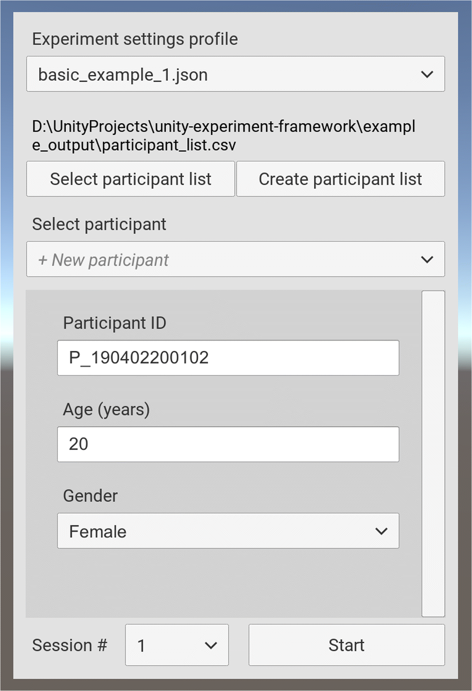

<p align="center">
  
</p>

# UXF - Unity Experiment Framework
A set of components which simplify human behaviour experiments developed in the Unity engine. This is the development project, if you want to download the package, do not clone this repository, see "Get Started" below. 

Read the [paper](https://doi.org/10.1101/459339) (preprint)

If you have developed a project using UXF please [let me know](http://twitter.com/jackbrookes)! 

**Contents**
- [Get started](#get-started)
- [Features](#features)
  - [Programming style](#programming-style)
  - [Data collection](#data-collection)
  - [Events](#events)
  - [CSV Participant List](#csv-participant-list)
  - [Settings system](#settings-system)
  - [UI](#ui)
  - [File IO](#file-io)
- [Example](#example)
- [Development](#development)
- [Documentation](#documentation)
- [Related packages](#related-packages)

## Get started

1. Import the latest ```UXF.unitypackage``` [release](https://github.com/immersivecognition/unity-experiment-framework/releases/latest) to your existing Unity project.

2. The UXF Setup Wizard will launch (or via the top menu: UXF > UXF Wizard) - Use it to fix .NET compatibility issues. 

3. Open an example scene.

4. Press play, and use the UI to create a new participant list in an appropriate directory.

5. Press start to begin the session.

Visit the [Wiki](https://github.com/immersivecognition/unity-experiment-framework/wiki) for more detail.

## Features

### Programming style

* Classes for common experimental concepts such as `Session`, `Block` & `Trial`
* Helps create maintainable and readable code fitting with Unity's Component System

### Data collection

UXF automates the process of collecting data.

**Behavioural data** is collected with 1 row per `Trial`, and automatically records some values such as the timestamp of the start and end of the trial. Developers can easily record observations of any type and associate them with a trial. Data is output with one row per trial in a results csv file.

**Continuous data** is data that is measured continuously over time during a trial. The main use case of this is to track the position and rotation of any object in the scene, which is captured at whatever frame rate the application is running at (in the `Update()` loop) by adding a `PositionRotationTracker` component to a GameObject. This can be used to track positions of user controlled objects (such as hands or head in a virtual reality application) or an arbitrary object in the scene (e.g. some kind of stimuli). However this system is generic and developers can create their own `Tracker` classes that perform measurements of any variable during trials. 

Data is stored in CSV files with automatic handling of file & directory naming.

UXF also stores other data in the form of `.json` files (full details on the [Wiki](https://github.com/immersivecognition/unity-experiment-framework/wiki)). Running a session with UXF will result in an output like this (assuming three trials with a tracked object called `object`).

```
Path: /experiment_name/participant_id/session_number/

Filename                   Description
------------------------ | ----------------------------------------------------------
log.csv                  | Copy of all Debug.Log calls during the Session
notes.json               | Notes collected by the Notes UI
participant_details.json | Copy of participant details (e.g. info entered via the UI)
object_movement_T001.csv | Position and rotation of "object" within trial 1
object_movement_T002.csv | Position and rotation of "object" within trial 2
object_movement_T003.csv | Position and rotation of "object" within trial 3
settings.json            | Copy of the settings applied to the Session
trial_results.csv        | Main results file (behavioural data)
```

### Events

A `UnityEvent` is invoked on `Trial` begin and end, allowing you to easily trigger presentation of stimuli at trial start (for example).

### CSV Participant List

A participant list feature is used allowing experimenters to optionally pre-prepare participant information. Additionally, this participant list is shared between experiments, allowing easy cross comparison of observations within participants.  

### Settings system

The settings is cascading, allowing setting independent variables at a `Session`, `Block`, or `Trial` level. Settings profiles can be stored as `.json` files and selected via the UI. This allows experimenters to deploy a single build of the experiment with several sub-experiments defined in settings profiles. The data for these sub-experiments is stored independently.   

### UI

A UI is available (but optional) allowing loading of participant data from file (or add new participant data). Variables that are collected are customisable and can be used in the experiment (e.g. a parameter for a participant's age could be used to change the difficulty of the experiment).



### File IO

Files are read and written in a separate thread to avoid frame drops, which can induce motion sickness in VR HMDs.

## Example

UXF classes will be useful in two main parts of your project: 

#### 1. Building up your experiment structure, including the trials, blocks and their associated settings.

```csharp
class ExperimentBuilder : Monobehaviour
{
    // set this to reference your UXF Session in the inspector
    public UXF.Session session;
    
    // assign this method to the Session OnSessionBegin UnityEvent in its inspector
    public void GenerateAndRun() 
    {       
        // Creating a block of 10 trials
        var myBlock = session.CreateBlock(10);

        // Add a new setting to trial 1, here just as an example we will apply a setting of "color" "red" 
        var firstTrial = myBlock.FirstTrial; //trial number is not 0 indexed
        firstTrial.settings["color"] = "red";

        // Run first trial
        session.nextTrial.Begin();
    }

    ...

}
```


#### 2. Accessing trial settings when they are needed: 

```csharp
class SceneManipulator : MonoBehaviour
{

    // set this to reference your UXF Session in the inspector
    public UXF.Session session;

    ...

    // assign this method to the Session OnTrialBegin UnityEvent in its inspector
    public void ShowStimulus(UXF.Trial trial)
    {
        // pull out the color we applied for this trial
        string colorManipulation = (string) trial.settings["color"];

        // example of using the new setting to manipulate our scene
        ManipulateSceneColor(colorManipulation);
    }

    // this could trigger on some user behaviour, collecting their score in a task
    public void RecordResultsAndEnd(int score)
    {
        // store their score
        session.currentTrial.results["score"] = score;
        // end this trial
        session.currentTrial.End();
    }

}
```

More examples are contained in the package.

## Development

This project is developed under Unity 2017.4.2f1 but should work on all recent versions of Unity.

## Documentation

Visit the [Wiki](https://github.com/immersivecognition/unity-experiment-framework/wiki)

## Related packages

* [UXF Web Settings](https://github.com/jackbrookes/uxf-web-settings)
* [UXF S3 Uploader](https://github.com/jackbrookes/uxf-s3-uploader)
